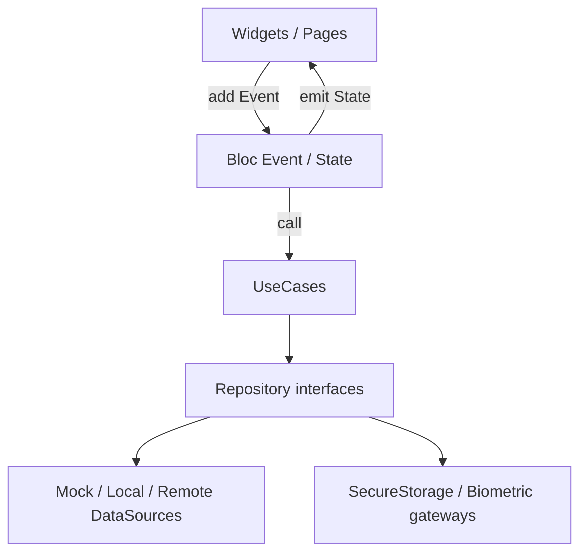
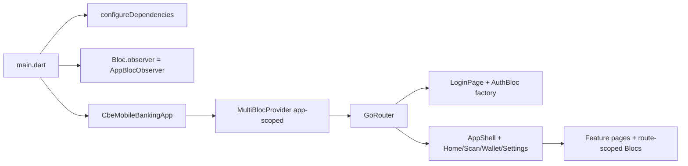
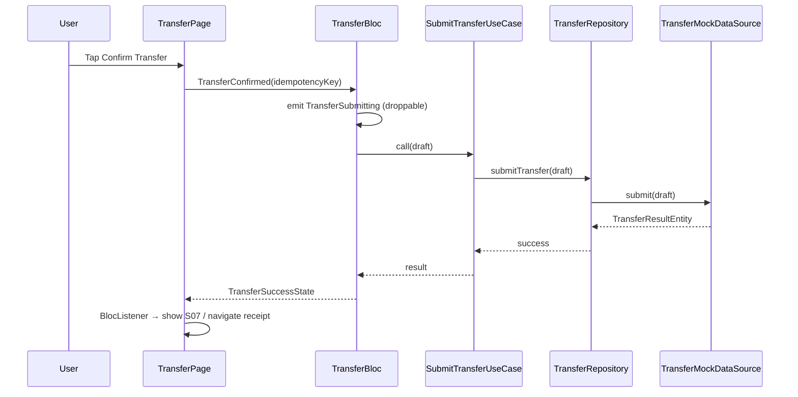
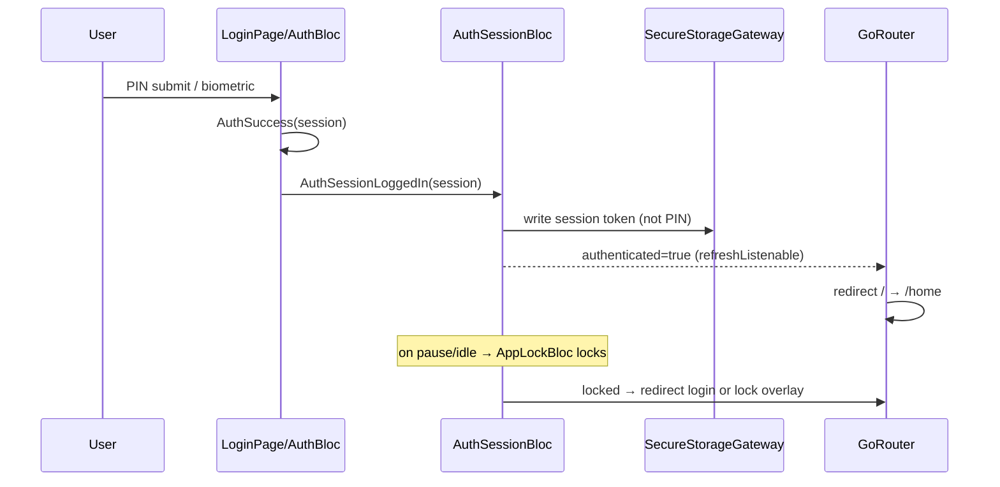
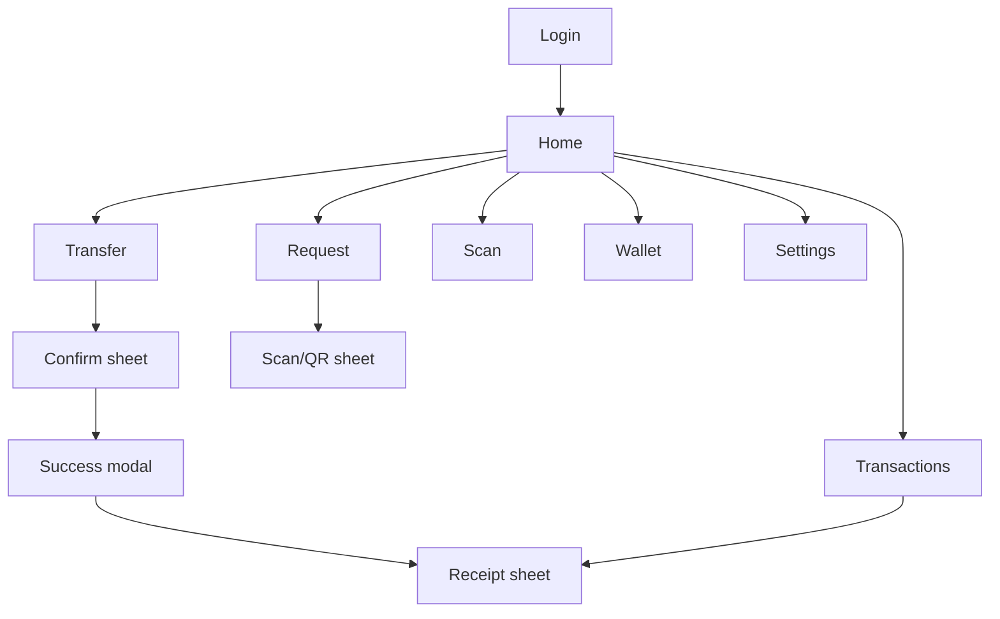

# CBE Mobile Banking — Engineering Blueprint

**Location:** `cbe_mobile_banking/blueprint.md` (Flutter app root; sits beside `ARCHITECTURE_STRUCTURE.md`).  
**UI source of truth:** `../CBE APP REDESIGNED.pdf` (12 pages).  
**Status:** Authoritative execution contract. If code and this file disagree, **update code to match this blueprint** (or amend this file via an explicit decision-log entry first).

---

## 0. Executive engineering contract

### Goal

Ship a **mock-first** Flutter rebuild of Commercial Bank of Ethiopia mobile banking matching the redesign PDF: auth unlock, dashboard, transfer (Bank / Payment / Wallet), request money (QR / account), scan, transactions + receipt, wallet tab, settings tab — all behind **100% `Bloc<Event, State>`** and Clean Architecture.

### Non-goals (v1)

- Real CBE / CBS / switch APIs (interfaces only; mock datasources)
- Pixel-perfect animation systems beyond what PDF implies
- Cubit, Riverpod, Provider-as-app-state, GetX, MobX
- Invented product surfaces not present in the PDF (cards hub, loans, forex, chat support, onboarding carousel, multi-account picker, bill-pay marketplace beyond “Payments” rail)
- Storing or logging plaintext PIN, OTP, tokens, or full account numbers

### Definition of “done” for whole v1

- [x] Every PDF screen/sheet/modal has a route + Bloc-backed presentation
- [x] Auth session gate works (unauthenticated → login; authenticated → shell)
- [x] Transfer and Request money complete end-to-end on mock data with Confirm → Success
- [x] Balances / accounts masked by default; Show/Hide via events
- [x] `flutter analyze` clean; unit tests for every Bloc (golden + failure + double-submit where money/auth)
- [x] Zero Cubit references in `lib/` and `test/`
- [x] No business logic in Widgets; UI only `add(Event)` + render `State`
- [x] Logging redaction audit passes (no PIN/token/full PAN in logs)

### Non-negotiable rules

1. **Bloc-only.** `Bloc<Event, State>` for every stateful feature and every app-scoped session concern. **Cubit is banned.**
2. **Clean Architecture dependency rule:** Presentation → Domain ← Data. Domain has zero Flutter UI / Dio / secure-storage SDK imports.
3. **Blocs call UseCases only** (never DataSources / Dio / FlutterSecureStorage directly).
4. **No secrets in repo.** `.env` gitignored; `.env.example` placeholders only.
5. **No PII/PIN/OTP/full account numbers in logs or Bloc state.** Mask via `AccountMasker`; PIN held only in controllers / ephemeral event payload, never persisted in `State`.
6. **Mock-first** until an explicit Integration phase flips repository bindings.
7. **One blueprint Step at a time.** Do not start Step N+1 until Step N DoD is green.

---

## 1. Product & UX scope from PDF

### Actors & jobs-to-be-done

| Actor | Primary JTBD |
|-------|----------------|
| Retail CBE customer | Unlock app (PIN / biometrics), see balance, send money (bank / payment ID / wallet), request money (QR / account), scan QR, review history & receipt, open wallet/settings tabs |

### Complete screen inventory (from PDF)

| ID | Screen / surface | PDF ref | Feature module | Entry points | Exit points | Auth required |
|----|------------------|---------|----------------|--------------|-------------|---------------|
| S01 | Login (PIN + biometric) | p.1 | `auth` | App cold start / session expired / logout | → S02 on success | No |
| S02 | Home / Dashboard | p.2 | `home` (+ shell) | Post-login; bottom nav Home | → S03/S04/S05 via Transfer; → S08 Request; services rows; Transfer Again; Requests Proceed; → S06 Scan / S11 Wallet / S12 Settings | Yes |
| S03 | Transfer — Bank rail | p.3 | `transfer` | Home Transfer CTA / Transfer to Bank service | → S06 confirm; back → S02 | Yes |
| S04 | Transfer — Payment rail | p.4 | `transfer` | Home / rail switch | → S06; back | Yes |
| S05 | Transfer — Wallet rail | p.5 | `transfer` | Home / rail switch | → S06; back | Yes |
| S06 | Transfer confirmation bottom sheet | p.6 | `transfer` | Next from S03–S05 / Quick Transfer | Confirm → S07; dismiss → form | Yes |
| S06b | Quick Transfer panel (on dashboard chrome) | p.6 (behind sheet) | `transfer` / `home` | Home context | Feeds confirm | Yes |
| S07 | Transfer Successful modal | p.7 | `transfer` | After confirm | Close → S02; Receipt → S10b | Yes |
| S08 | Request money (QR + Account forms) | p.8 | `request_money` | Home Request CTA | Generate QR → S09; Send Request success toast/state; back → S02 | Yes |
| S09 | Scan QR code bottom sheet | p.9 | `scan` / `request_money` | From Request flow / Scan tab | Dismiss → S08 or Scan page | Yes |
| S10 | Transactions list | p.10 | `transactions` | Home link / future deep link | Tap row → S10b; back | Yes |
| S10b | Receipt Detail bottom sheet | p.11 | `transactions` | Transaction tap / Success Receipt | View Receipt (PDF later); dismiss | Yes |
| S11 | Wallet tab | Bottom nav (p.2, p.7, p.10) — **no dedicated PDF frame** | `wallet` | Bottom nav | Back / other tabs | Yes |
| S12 | Settings tab | Bottom nav — **no dedicated PDF frame** | `settings` | Bottom nav | Back / other tabs | Yes |
| S13 | Design tokens / palette | p.12 | `core/theme` | N/A | N/A | N/A |

### Implicit / variant states (not drawn as separate frames — must still be implemented)

| Variant | Applies to | Notes |
|---------|------------|--------|
| Balance masked vs visible | S02 | PDF: Show / Hide |
| Loading | All data screens | Spinner / skeleton — not in PDF; required |
| Empty list | S10, Transfer Again | Not in PDF; required |
| Validation error | S01, S03–S05, S08 | Inline / snackbar via BlocListener |
| Failure + retry | Auth, Transfer submit, Home refresh | Required fintech |
| Search field chrome | S02–S11 | PDF shows “Search anything”; v1 = UI chrome + `SearchBloc` stub or Home-local event; **no full search backend in PDF** |

### Out of scope for v1 (not in PDF as screens)

- Splash / onboarding carousel (PDF starts at Login)
- Multi-account switcher, card management suite, loans, forex
- Full bill-pay catalog (only “Payments” as transfer rail + home service row copy)
- Beneficiaries management module (recent recipients live under Home/Transfer)
- Notifications center (only “3 Requests” banner on Home)
- Help / support / branch locator
- Light theme (PDF is dark plum + peach; palette p.12 includes white/black for contrast tokens only)

---

## 2. Tech stack & architectural decisions (ADR style)

### ADR-01 — Flutter stable channel

| | |
|--|--|
| **Decision** | Flutter stable (project currently 3.44.x / Dart 3.12.x) |
| **Why** | Predictable tooling for regulated delivery |
| **Consequences** | Pin CI to stable; no master experiments in main |

### ADR-02 — 100% flutter_bloc (zero Cubit)

| | |
|--|--|
| **Decision** | All app state = `Bloc<Event, State>` + `equatable`. Cubit forbidden. |
| **Why** | Explicit events improve auditability, replay, and fintech test matrices; matches existing Auth sample |
| **Consequences** | More boilerplate; every UI intent is a named Event |

### ADR-03 — Clean Architecture, feature-first

| | |
|--|--|
| **Decision** | `features/<name>/{presentation,domain,data}` + `core/` + `app/` as in `ARCHITECTURE_STRUCTURE.md` |
| **Why** | Aligns with scaffold already in repo; testable money paths |
| **Consequences** | Blocs → UseCases → Repository interfaces only |

### ADR-04 — get_it DI

| | |
|--|--|
| **Decision** | `GetIt` in `lib/app/di/injection.dart` |
| **Why** | Already in project; simple factory/singleton lifetimes for Blocs |
| **Consequences** | App-scoped Blocs = `registerLazySingleton`; route Blocs = `registerFactory` + `BlocProvider(create: (_) => sl()..add(...))` |

### ADR-05 — go_router + auth redirect

| | |
|--|--|
| **Decision** | `go_router` with `refreshListenable` driven by `AuthSessionBloc` / session |
| **Why** | Declarative redirects; deep-link ready |
| **Consequences** | Login route public; all others require session |

### ADR-06 — dio + interceptor stubs

| | |
|--|--|
| **Decision** | `DioClient` + safe `LoggingInterceptor` (method/path only) |
| **Why** | Ready for remote without leaking bodies |
| **Consequences** | Mock datasources unused Dio until Integration phase |

### ADR-07 — flutter_secure_storage + local_auth

| | |
|--|--|
| **Decision** | Gateways in `core/security/*`; mock impls when `APP_ENV=mock` |
| **Why** | Fintech baseline; Chrome/web uses in-memory + mock biometric |
| **Consequences** | Biometric = unlock convenience; PIN remains source of truth for mock auth |

### ADR-08 — Mock datasources first

| | |
|--|--|
| **Decision** | `*MockDataSource` behind repository interfaces; remote later same interface |
| **Why** | PDF-driven UI without bank credentials |
| **Consequences** | Fixture files under `lib/features/*/data/fixtures/` or `assets/mock/` |

### ADR-09 — equatable now; freezed later (optional)

| | |
|--|--|
| **Decision** | **Equatable sealed classes** for Events/States/Entities in v1 (current codebase). Do **not** introduce freezed until API DTOs force codegen. |
| **Why** | Avoids build_runner tax during mock phase; Auth sample already Equatable |
| **Consequences** | Manual `props`; consistent sealed hierarchies |

### ADR-10 — bloc_concurrency

| | |
|--|--|
| **Decision** | Add `bloc_concurrency` when implementing Step hardening / transfer submit |
| **Why** | `droppable` prevents double-pay; `debounce` for search; `restartable` for refresh |
| **Consequences** | Document transformer per critical event (§4.6) |

---

## 3. System architecture

### 3.1 Layer diagram



### 3.2 App runtime topology



**App-scoped (singleton GetIt + root `MultiBlocProvider`):**

- `AuthSessionBloc`
- `AppLockBloc`

**Route-scoped (factory GetIt + page `BlocProvider`):**

- `AuthBloc` (login only), `HomeBloc`, `TransferBloc`, `RequestMoneyBloc`, `TransactionsBloc`, `ScanBloc`, `WalletBloc`, `SettingsBloc`

### 3.3 Money movement sequence (Transfer)



### 3.4 Auth / session sequence



---

## 4. 100% BLoC architecture guide

### 4.1 Bloc taxonomy

| Bloc | Scope | DI lifetime | Primary events | Primary states | Use cases | Security notes |
|------|-------|-------------|----------------|----------------|-----------|----------------|
| `AuthSessionBloc` | App | Singleton | `AuthSessionRestoreRequested`, `AuthSessionLoggedIn`, `AuthSessionLoggedOut`, `AuthSessionExpired` | `AuthSessionUnknown`, `AuthSessionAuthenticated`, `AuthSessionUnauthenticated` | `RestoreSession`, `ClearSession` | Token in secure storage; never PIN |
| `AppLockBloc` | App | Singleton | `AppLockStarted`, `AppLifecycleChanged`, `AppUnlockRequested`, `AppLockForced` | `AppLockUnlocked`, `AppLockLocked`, `AppLockBiometricInProgress` | Biometric gateway | Lock on background/timeout |
| `AuthBloc` | Route (login) | Factory | `AuthPinDigitEntered`*, `AuthPinSubmitted`, `AuthBiometricRequested`, `AuthReset` | `AuthInitial`, `AuthPinEntry`, `AuthLoading`, `AuthSuccess`, `AuthFailureState` | `LoginWithPin`, `LoginWithBiometrics` | PIN only in Event; not in State |
| `HomeBloc` | Route | Factory | `HomeStarted`, `HomeRefreshed`, `HomeBalanceVisibilityToggled`, `HomeSearchChanged` | `HomeInitial`, `HomeLoading`, `HomeLoaded`, `HomeFailureState` | `GetHomeDashboard` | Masked account/balance by default |
| `TransferBloc` | Route | Factory | See F03 tables | Form → Confirm → Submitting → Success/Failure | `SubmitTransfer`, (later `ValidateBeneficiary`) | `droppable` on confirm; idempotency key |
| `RequestMoneyBloc` | Route | Factory | Mode/amount/account/submit | Form → Submitting → Success/Failure | `CreatePaymentRequest` | Amount validation in Bloc |
| `ScanBloc` | Route | Factory | `ScanStarted`, `ScanCodeDetected`, `ScanFailed`, `ScanReset` | `ScanIdle`, `ScanListening`, `ScanSuccess`, `ScanFailure` | Optional `ParseQrPayload` | No camera secrets in logs |
| `TransactionsBloc` | Route | Factory | `TransactionsStarted`, `TransactionSelected`, `ReceiptDismissed`, `TransactionsRefreshed` | Loading/Loaded(+receipt)/Failure | `GetTransactions`, `GetReceipt` | Mask receiver where needed |
| `WalletBloc` | Route | Factory | `WalletStarted`, `WalletRefreshed` | Loading/Loaded/Failure | `GetLinkedWallets` | Stub content until design expands |
| `SettingsBloc` | Route | Factory | `SettingsStarted`, `SettingsBiometricsToggled`, `SettingsLogoutRequested` | Loaded + flags | Prefer dispatch logout → `AuthSessionBloc` | No secrets in state |

\*Optional digit-level events; v1 may keep `TextEditingController` + single `AuthPinSubmitted(pin)` (see exception policy §4.4).

**Existing code note:** Feature Blocs already exist under `lib/features/*/presentation/bloc/`. This blueprint **extends** them with `AuthSessionBloc` + `AppLockBloc` and tightens state machines — do not replace with Cubit.

### 4.2 Event design standards

- **Naming:** `<Feature><Noun><PastOrImperative>` → `TransferAmountChanged`, `TransferSubmitted`, `TransferRetried`, `HomeBalanceVisibilityToggled`.
- **Payloads:** typed fields only (`String amountText`, `TransferRail rail`). No `Map<String, dynamic>`.
- **Validation (ONE standard):** **Validate in the Bloc** (and UseCase for domain invariants). UI shows `state.validationMessage` / field errors from state. Widgets do not call validators to decide navigation.
- **Double-submit:** Confirm/Pay events use `droppable()`; Bloc ignores confirm unless current state is `TransferConfirmState`.
- **Idempotency:** `TransferConfirmed` / `RequestSubmitted` carry `String idempotencyKey` (UUID generated in UI at first confirm tap or in Bloc on entering confirm). Mock DS stores last key to ignore duplicates.

### 4.3 State design standards

**System-wide pattern (MANDATORY):** **Sealed state hierarchies** + `Equatable` (as in current `AuthState`, `TransferState`).  
Do **not** use a single mega-state with ambiguous booleans like `isLoading && isSubmitting && hasError`.

**Money / auth flows must implement this machine:**

```
Initial/Idle → Loading/Ready → (ValidationError stays on Ready)
  → Confirm → Submitting → Success | Failure(retry)
```

**Rules:**

- Amounts as `double`/`Decimal` in domain; display via `MoneyFormatter` (ETB).
- Accounts in state = **masked** or last-4 only for lists; full number only inside secure confirm draft held briefly (prefer masked in UI, full only in usecase input from form fields not re-emitted).
- **Never** store raw PIN/password/OTP in State.
- Distinguish `HomeLoading` (full) vs optional `isRefreshing` on `HomeLoaded` for pull-to-refresh.
- User-facing errors = safe messages; optional `errorCode` for support (no stack traces in UI).

### 4.4 Presentation binding standards

| API | Use |
|-----|-----|
| `context.read<XBloc>()` | Dispatch events, one-off in callbacks |
| `BlocBuilder` / `BlocSelector` | Build UI from state |
| `BlocListener` / `BlocConsumer` | Navigation, SnackBar, dialogs, biometric prompts |
| `BlocSelector` | Dashboard lists — select `recipients` only |

**BlocProvider:**

- App-scoped: root `MultiBlocProvider` in `app.dart`
- Feature: page-level `BlocProvider(create: (_) => sl<FooBloc>()..add(Started()))`

**setState exception policy (ONLY):**

Allowed for ephemeral pure-UI: `TextEditingController`, `FocusNode`, `TabController` animation tick, obscuring PIN dots local paint.  
**Forbidden:** using setState for balance visibility, form rail, submit lifecycle, lists from network/mock.

**Forbidden:** calling repositories/use cases from Widgets.

### 4.5 Cross-feature Bloc communication

**Allowed:**

- UI listens to `AuthSessionBloc` for redirects
- After `AuthBloc` success → `context.read<AuthSessionBloc>().add(AuthSessionLoggedIn(...))`
- Logout from Settings → `AuthSessionLoggedOut`
- Router `refreshListenable` wrapping session

**Forbidden:**

- `TransferBloc` holding reference to `HomeBloc` and calling methods
- Service locator anti-pattern `sl<HomeBloc>().add` from Transfer
- Event bus / streams coupling features ad hoc

**Refresh home after transfer:** navigate to home with `extra: refresh=true` or re-`HomeStarted` on `HomePage` init — not cross-Bloc calls.

### 4.6 Concurrency & transformers

| Event | Transformer | Rationale |
|-------|-------------|-----------|
| `TransferConfirmed` | `droppable` | Prevent double debit |
| `RequestSubmitted` | `droppable` | Prevent duplicate QR/request |
| `AuthPinSubmitted` / biometric | `droppable` | Prevent parallel login |
| `HomeRefreshed` / `TransactionsRefreshed` | `restartable` | Latest refresh wins |
| `HomeSearchChanged` | `debounce(300ms)` | Search chrome |
| `TransferAmountChanged` | sequential default / optional debounce | Avoid spam validation |

Add dependency: `bloc_concurrency` when implementing these transformers.

### 4.7 Testing standard for Blocs

- Package: `bloc_test`, `mocktail` (add in delivery steps that introduce them).
- Every Bloc: at least one happy path + one failure path.
- Auth + Transfer: invalid event order (confirm without draft), double submit (second confirm ignored), masked fields assertions.
- UseCases: unit tests with fake repositories (already started for Auth/Home).
- **Minimum:** AuthBloc, AuthSessionBloc, TransferBloc, RequestMoneyBloc ≥ failure + double-submit tests before calling money flows “done”.

---

## 5. Clean Architecture mapping

### Folder conventions (existing — extend, don’t fork)

```
lib/
  app/          app.dart, di/injection.dart, router/app_router.dart
  core/         bloc/, error/, network/, security/, theme/, utils/, widgets/, constants/
  features/
    auth|home|transfer|request_money|scan|transactions|wallet|settings/
      presentation/bloc|pages|widgets
      domain/entities|repositories|usecases
      data/datasources|repositories|models|mappers|fixtures
```

### Dependency rule checklist

- [ ] Domain files import only Dart + other domain + `core/error/failures.dart` (no Flutter Material)
- [ ] Blocs import use cases + entities + events/states only
- [ ] Data implements domain interfaces; maps models → entities
- [ ] No feature imports another feature’s `data/` layer

### Mapper boundary

`SessionModel` / DTOs stay in `data/`; `SessionEntity` in `domain/`; `SessionMapper` in `data/mappers/`.

---

## 6. Security & compliance (fintech bar)

### Phase A — v1 mock (required)

| Control | Implementation |
|---------|----------------|
| Session token | `SecureStorageGateway`; mock = in-memory |
| PIN | Validated in usecase; **never** written to storage in plaintext; mock accepts `AppConstants.mockPin` |
| Biometric | Unlock / login convenience via `BiometricGateway`; failure → fallback PIN |
| Masking | `AccountMasker`, balance hide default on Home |
| Logging | `AppLogger` + interceptor: no bodies; `AppBlocObserver` logs **runtimeType only** |
| Cleartext HTTP | Android `usesCleartextTraffic=false` (already) |
| Face ID string | iOS `NSFaceIDUsageDescription` (already) |

### Phase B — hardening (blueprint Step 11)

| Control | Notes |
|---------|-------|
| App lock idle timeout | **Done** — `AppLockBloc` + lifecycle; idle = 45s (`AppConstants.appLockIdleTimeout`) |
| FLAG_SECURE / iOS screen capture | **Done** — `SecureScreen` / MethodChannel on Login, Transfer, Receipt |
| Cert pinning | **Deferred** — Dio adapter hook only when real hosts land (A11) |
| Root/jailbreak | **Deferred** — plugin later; gate high-risk actions (A12) |
| PIN hash at rest | N/A mock — PIN never persisted; unlock uses biometrics / re-entry |

### Logging redaction policy

**Never log:** PIN, password, OTP, bearer token, full account, full phone, raw QR payment payload with PII.  
**May log:** event/state type names, HTTP method + path, error codes, masked account (`1000********7601`), amounts only in debug builds if product allows (default: **omit amounts in production logs**).

### MASVS-inspired checklist (mapped)

| Control area | Feature mapping |
|--------------|-----------------|
| AuthN | AuthBloc + AuthSessionBloc + AppLockBloc |
| Crypto/storage | SecureStorageGateway |
| Network | Dio TLS; no cleartext |
| Privacy | Masking + Show/Hide |
| Resilience | Failure states + retry events |

### Threat notes

- **Transfer confirm:** overlay phishing — use in-app sheet tied to Bloc confirm state only.
- **Login:** shoulder surfing — masked PIN field; biometric preferred.
- **Receipt:** screenshot risk — Phase B FLAG_SECURE.

---

## 7. Design system extracted from PDF

### Color tokens (p.12 + UI)

| Token | Value | Usage |
|-------|-------|-------|
| `plumDeep` | `#1A0D1F` | Scaffold |
| `plum` | `#2D142C` | Surfaces / cards dark |
| `plumAccent` | `#6B2D6B` | Accents |
| `peach` | `#EBC29D` | Primary CTA, balance card, active icons |
| `white` / `black` | `#FFF` / `#000` | Text on dark / on peach |
| `muted` | `#B8A5B5` | Secondary labels |
| `credit` / `debit` | `#2ECC71` / `#E74C3C` | Transaction amounts |

Implement in `lib/core/theme/app_colors.dart` (exists).

### Typography

- UI: sans (Material 3).
- Titles like “Transactions”: slightly display/serif treatment allowed (PDF).
- Encode in `app_typography.dart`.

### Shape

- High corner radius / stadium CTAs (~24–28).
- Balance card: guilloche/spirograph pattern (asset or `CustomPainter` later).

### Components → shared widgets

| PDF component | Widget |
|---------------|--------|
| Peach CTA | `AppPrimaryButton` |
| Outlined secondary | `AppSecondaryButton` (add) |
| Balance card | `BalanceCard` (home/widgets) |
| Rail chips Payment/Bank/Wallet | `TransferRailSelector` |
| Bottom sheet confirm | `TransferConfirmSheet` |
| Success modal | `TransferSuccessDialog` |
| Transaction row | `TransactionListTile` |
| Bottom nav | `MainShell` NavigationBar |
| Search field | `AppSearchField` (chrome) |

### Accessibility

- Min 48dp tap targets on CTAs and biometric.
- Semantics labels: “Balance hidden”, “Amount 50,000 Ethiopian Birr”.
- Contrast: peach on plum for primary actions (verify WCAG AA for body text).

---

## 8. Navigation & information architecture

### Route table

| Path | Name | Screen | Guard |
|------|------|--------|-------|
| `/login` | login | S01 | Public |
| `/home` | home | S02 | Auth |
| `/transfer` | transfer | S03–S07 | Auth |
| `/request` | requestMoney | S08–S09 | Auth |
| `/scan` | scan | S09/Scan tab | Auth |
| `/transactions` | transactions | S10–S10b | Auth |
| `/wallet` | wallet | S11 | Auth |
| `/settings` | settings | S12 | Auth |

*(Migrate current `/` login to `/login` in Step 0/1 for clarity; keep redirect from `/`.)*

### Auth redirect rules

- `!authenticated` && location != login → `/login`
- `authenticated` && location == login → `/home`
- `AppLockLocked` → lock overlay or force re-auth route (product: re-open Login with biometric)

### Shell

Bottom nav from PDF: **Home · Scan · Wallet · Settings**.  
Transfer / Request / Transactions are **stack pushes** from Home (not tab roots).

### Sitemap



---

## 9. Feature module specifications

### F01 — Auth (Login)

- **PDF:** p.1  
- **Screens:** S01  
- **Stories:** As a customer I unlock with 4-digit PIN or biometrics.  
- **Bloc:** `AuthBloc` (route) + writes to `AuthSessionBloc` on success  

**Events**

| Event | Payload |
|-------|---------|
| `AuthPinSubmitted` | `String pin` |
| `AuthBiometricRequested` | — |
| `AuthReset` | — |

**States**

| State | Data |
|-------|------|
| `AuthInitial` | — |
| `AuthLoading` | — |
| `AuthSuccess` | `SessionEntity` (token, display name, masked-ready account) |
| `AuthFailureState` | `message` |

**Domain:** `SessionEntity`  
**Use cases:** `LoginWithPinUseCase`, `LoginWithBiometricsUseCase`  
**Repo:** `AuthRepository`  
**Mock:** PIN `1234` (`AppConstants.mockPin`)  
**Edge cases:** wrong PIN, biometric cancel, lockout counter (v1: message only)  
**Security:** no PIN in state/logs  
**AC:** success navigates home via session; failure snackbar  
**Tests:** bloc_test happy/fail/droppable double submit  
**Prereq:** F00 session foundations  

---

### F02 — AuthSession & AppLock

- **PDF:** implied by Login + return to app  
- **Blocs:** `AuthSessionBloc`, `AppLockBloc` (app-scoped)  
- **Events/States:** see §4.1  
- **AC:** kill/relaunch restores session in mock; logout clears; background locks after timeout  

---

### F03 — Home / Dashboard

- **PDF:** p.2 (also chrome on p.3–6)  
- **Screens:** S02  
- **Stories:** See masked balance, Show/Hide, Transfer/Request, Transfer Again, pending requests, service rows, search chrome, bottom nav  

**Events:** `HomeStarted`, `HomeRefreshed`, `HomeBalanceVisibilityToggled`, `HomeSearchChanged`  
**States:** `HomeInitial`, `HomeLoading`, `HomeLoaded(dashboard, isBalanceVisible, searchQuery?)`, `HomeFailureState`  
**Entities:** `HomeDashboardEntity`, `AccountSummaryEntity`, `RecentRecipientEntity`  
**Use case:** `GetHomeDashboardUseCase`  
**Mock:** Girma Belay…, 100,000 ETB, 3 requests, recipients M/D/S/W/A  
**Edge:** refresh failure retry; empty recipients  
**Security:** default masked balance + masked account  
**AC:** matches PDF information architecture (not necessarily pixel-perfect yet)  

---

### F04 — Transfer

- **PDF:** p.3–7  
- **Screens:** S03–S07 (+ S06b quick transfer optional merge into form)  
- **Stories:** Choose Payment/Bank/Wallet; enter fields; Next → Confirm sheet; Confirm → Success modal; Receipt  

**Events**

| Event | Payload |
|-------|---------|
| `TransferStarted` | — |
| `TransferRailSelected` | `TransferRail` |
| `TransferReceiverChanged` | `String` |
| `TransferDestinationChanged` | `String` |
| `TransferAmountChanged` | `String` |
| `TransferReviewRequested` | — |
| `TransferConfirmed` | `idempotencyKey` |
| `TransferRetried` | — |
| `TransferReset` | — |

**States:** `TransferFormState`, `TransferConfirmState`, `TransferSubmitting`, `TransferSuccessState`, `TransferFailureState`  

**State machine:** Form → (validation) → Confirm → Submitting → Success/Failure  

**Use case:** `SubmitTransferUseCase`  
**Mock result:** txn `FT7413103RYT`, sample copy from PDF p.7  
**Edge:** invalid amount, empty destination, submit timeout simulated, double confirm dropped  
**Security:** confirm sheet shows destination; mask where long; droppable submit  
**AC:** Bank/Payment/Wallet field labels match PDF; success offers Close/Receipt  

---

### F05 — Request money

- **PDF:** p.8–9  
- **Events:** `RequestMoneyStarted`, `RequestModeSelected`, `RequestAmountChanged`, `RequestAccountChanged`, `RequestSubmitted(idempotencyKey)`  
- **States:** Form / Submitting / Success / Failure  
- **Use case:** `CreatePaymentRequestUseCase`  
- **AC:** QR mode generates payload; Account mode requires account field  

---

### F06 — Scan

- **PDF:** p.9 sheet + bottom nav icon  
- **Events/States:** §4.1 `ScanBloc`  
- **v1:** mock detect button (camera optional later)  
- **AC:** success shows payload; reset re-listens  

---

### F07 — Transactions & Receipt

- **PDF:** p.10–11  
- **Events:** `TransactionsStarted`, `TransactionsRefreshed`, `TransactionSelected(id)`, `ReceiptDismissed`  
- **States:** Loading / Loaded(items, selectedReceipt?) / Failure  
- **Use cases:** `GetTransactionsUseCase`, `GetReceiptUseCase`  
- **Mock:** House Rent, Tele Birr, Abyssinia, etc.; receipt FT2455161RQL1H  
- **AC:** credit green / debit red; sheet matches fields  

---

### F08 — Wallet (tab stub)

- **PDF:** nav only  
- **Bloc:** `WalletBloc` loads linked wallet names mock  
- **AC:** tab works; no crash; placeholder honest to PDF gap  

---

### F09 — Settings (tab stub)

- **PDF:** nav only  
- **Bloc:** `SettingsBloc` biometrics toggle + logout → session  
- **AC:** logout returns to login  

---

## 10. Sequential delivery plan

**Rule:** Each step = Bloc-backed vertical slice + tests. No UI-without-Bloc. Stop until DoD green.

### Step 0 — Blueprint alignment & theme/shell routes

1. **Goal:** Routes + theme tokens match this blueprint; document AuthSession placeholders.  
2. **PDF:** p.12, nav chrome  
3. **Files:** `app_router.dart`, `app_theme.dart`, `app_colors.dart`, optional `MainShell`  
4. **Blocs:** none new required  
5. **DoD:** analyze clean; `/login` & `/home` paths consistent  
6. **Stop rule:** no Step 1 until routes compile  

### Step 1 — AuthSessionBloc + AppLockBloc foundations

1. **Goal:** App-scoped session + lock state machines  
2. **PDF:** p.1 implied session  
3. **Files:** `features/auth/presentation/bloc/auth_session_*.dart`, `features/auth/presentation/bloc/app_lock_*.dart` (or `core/session/`), `injection.dart`, `app.dart` MultiBlocProvider, router redirect  
4. **Events/States:** §4.1  
5. **Tests:** session restore authenticated/unauthenticated; lock on lifecycle  
6. **DoD:** redirects work with fake session; no Cubit  
7. **Stop**

### Step 2 — Session restore on startup

1. **Goal:** `AuthSessionRestoreRequested` on `main`  
2. **PDF:** —  
3. **Use case:** `RestoreSessionUseCase` + secure storage read  
4. **DoD:** mock token restores to home; empty → login  

### Step 3 — Login PIN/biometric polish (AuthBloc)

1. **Goal:** PDF p.1 parity + session handoff  
2. **PDF:** p.1  
3. **Files:** `login_page.dart`, `auth_bloc/*`, secure/mock biometric  
4. **Tests:** AuthBloc pin success/fail; biometric fail  
5. **QA:** PIN 1234 → home; wrong PIN error; no PIN in logs  
6. **DoD:** analyze + tests; listener navigates via session not raw `context.go` alone  

### Step 4 — HomeBloc dashboard

1. **Goal:** S02 data + Show/Hide + nav CTAs  
2. **PDF:** p.2  
3. **Files:** home domain/data/presentation  
4. **Tests:** HomeBloc load + toggle visibility  
5. **QA:** masked by default; Transfer/Request navigation  
6. **DoD**

### Step 5 — WalletBloc tab

1. **Goal:** Honest stub list  
2. **PDF:** nav  
3. **DoD:** Bloc-backed tab  

### Step 6 — TransactionsBloc list + receipt sheet

1. **Goal:** S10–S10b  
2. **PDF:** p.10–11  
3. **Tests:** select receipt / dismiss  
4. **DoD**

### Step 7 — TransferBloc full state machine

1. **Goal:** S03–S07 with droppable confirm + idempotency  
2. **PDF:** p.3–7  
3. **Add:** `bloc_concurrency`  
4. **Tests:** validation, confirm, success, double-submit, failure retry  
5. **QA:** Bank/Payment/Wallet labels; confirm amounts; success Close/Receipt  
6. **DoD**

### Step 8 — RequestMoneyBloc

1. **Goal:** S08 (+ QR success)  
2. **PDF:** p.8  
3. **Tests:** droppable submit; validation  
4. **DoD**

### Step 9 — ScanBloc

1. **Goal:** S09 / Scan tab mock  
2. **PDF:** p.9  
3. **DoD**

### Step 10 — SettingsBloc + logout

1. **Goal:** biometrics flag + logout clears session  
2. **PDF:** nav  
3. **DoD**

### Step 11 — Hardening

1. **Goal:** AppLock timeout, FLAG_SECURE notes/impl, redaction audit, transformers on all money events  
2. **DoD:** checklist §6 Phase B items marked done or explicitly deferred in §13  

### Step 12 — PDF visual polish

1. **Goal:** empty/error/loading parity; balance card pattern; success modal layout  
2. **PDF:** all pages  
3. **DoD:** design review against PDF; still Bloc-only  

---

### Per-step template (enforce)

For Step N implementers must deliver:

1. Goal  
2. PDF refs  
3. Files touched  
4. Events/states  
5. Use cases + mock DS  
6. UI via BlocProvider/BlocConsumer  
7. `bloc_test` list  
8. Manual QA (fintech)  
9. **DoD:** analyze clean; tests pass; no Cubit; no logic in UI; masked sensitive data  
10. **Stop** — do not start N+1  

---

## 11. Mock data & anti-corruption layer

### Fixture layout

```
lib/features/home/data/fixtures/dashboard.json
lib/features/transfer/data/fixtures/transfer_success.json
lib/features/transactions/data/fixtures/transactions.json
lib/features/transactions/data/fixtures/receipt.json
```

(Or Dart const fixtures — acceptable in mock phase.)

### Example contracts

**Dashboard (conceptual):**

```json
{
  "customerName": "Girma Belay Terunehe",
  "accountNumber": "1000582007601",
  "balanceEtb": 100000,
  "pendingRequestCount": 3,
  "recentRecipients": [{ "initial": "M", "lastFour": "5744", "fullName": "...", "accountNumber": "..." }]
}
```

**Transfer success:** `transactionId`, `amountEtb`, `message` (PDF p.7 style).

### Mock → Remote switch

- `SecureConfig.isMock` / `APP_ENV`  
- DI registers `*MockDataSource` vs `*RemoteDataSource` implementing same interface  
- Blocs/use cases **unchanged**

### Error simulation

Mock DS throws `AuthException` / `ServerException` when amount `== 13` or header flag — map to `Failure` → Bloc Failure state for QA.

---

## 12. Coding standards & AI execution protocol

### Standards

- `very_good_analysis` (project default); keep `one_member_abstracts: false` for repo interfaces  
- snake_case files; `FeatureBloc` / `FeatureEvent` / `FeatureState`  
- Import order: package alphabetical (CI/analyze enforced)  
- PR = **one blueprint Step**  
- Commits: `feat(transfer): step 7 confirm droppable submit`

### Implementer prompt (copy/paste)

```
Implement blueprint Step X exactly from cbe_mobile_banking/blueprint.md.
Constraints:
- 100% Bloc only (no Cubit anywhere)
- Clean Architecture dependency rule
- mock data only
- UI dispatches Events only; side effects in BlocListener
Deliver: code + bloc tests + DoD checklist results.
Stop when Step X Definition of Done is met. Do not start Step X+1.
```

---

## 13. Risks, PDF ambiguities, and decisions log

| ID | Item | Decision |
|----|------|----------|
| A1 | Wallet/Settings have no PDF frames | Ship Bloc-backed stubs; no invented mega-UI |
| A2 | Search “Search anything” | Chrome + debounce event; no full search product in v1 |
| A3 | Quick Transfer vs form (p.6) | Prefer single `TransferBloc` form; Quick Transfer optional fields later |
| A4 | Splash missing | Cold start → session restore → login/home (no splash marketing) |
| A5 | Success message name confusion in PDF | Use coherent mock names in fixtures; don’t copy broken PDF grammar literally |
| A6 | COMMERICAL typo on p.1 | UI string = **COMMERCIAL** |
| A7 | Freezed | Deferred (ADR-09) |
| A8 | Existing Blocs already scaffolded | Harden to this blueprint’s state machines; add AuthSession/AppLock |
| A9 | Transactions not in bottom nav | Reachable from Home (PDF doesn’t give tab) |
| A10 | Offline | Failure state + retry; no offline DB in v1 |
| A11 | Cert pinning | Deferred until production API hosts exist |
| A12 | Root/jailbreak detection | Deferred post-mock; not required for v1 demo |
| A13 | Idle lock duration | **45s** background idle (`AppConstants.appLockIdleTimeout`) |
| A14 | Unlock after idle | Biometric preferred via overlay; PIN login remains available |
| A15 | “3 Requests → Proceed” | Opens `/requests` inbox (not Create Request) |

### Open questions (product/design)

_None blocking v1 mock — prior open questions resolved in A13–A15._
---

## Appendix — Forbidden list (enforcement)

- Cubit, Riverpod, Provider app state, GetX  
- Business logic in `build()`  
- Repository calls from UI  
- Raw PIN in State or logs  
- Starting Step N+1 early  
- Inventing non-PDF major features in v1  

---

**End of blueprint.** Execute Steps 0→12 in order. Treat this file as the constitution for CBE Mobile Banking redesign engineering.
